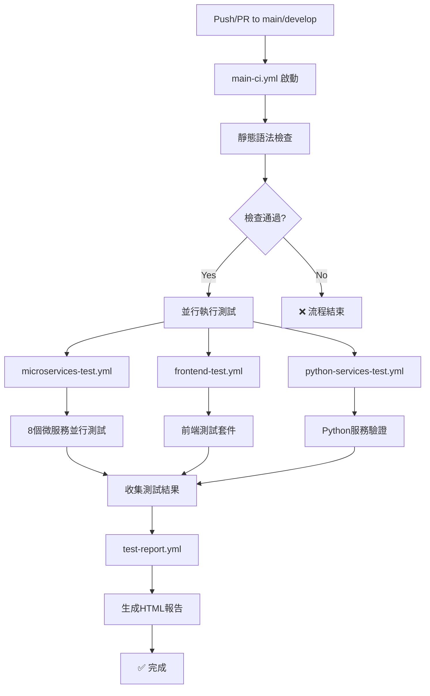

# GitHub Actions 本地測試指南

## 📋 Workflows 分類說明

### 當前可用的 Workflows

| Workflow 文件 | 類型 | 主要功能 | 觸發條件 | 執行時間 |
|--------------|------|----------|----------|----------|
| **main-ci.yml** | 🚀 **主流程控制** | CI/CD 總協調器，整合所有測試階段 | `push`/`pull_request` to `main`/`develop`, `workflow_dispatch` | ~15-20 分鐘 |
| **microservices-test.yml** | 🔧 **微服務測試** | 8 個 TypeScript 微服務的並行測試 | 路徑變化：`microServices/**` | ~10 分鐘 |
| **frontend-test.yml** | 🎨 **前端測試** | Vue.js 前端的單元和整合測試 | 路徑變化：`frontend/**` | ~15 分鐘 |
| **python-services-test.yml** | 🐍 **Python 服務測試** | LLM 服務的 Python 語法和導入測試 | 路徑變化：`microServices/llm-service/**` | ~15 分鐘 |
| **test-report.yml** | 📊 **報告生成器** | 收集所有測試結果並生成 HTML 報告 | 其他 workflows 完成後自動觸發 | ~5 分鐘 |

### 🏗️ CI/CD 流程架構



### 🎯 測試覆蓋範圍

#### TypeScript 微服務 (microservices-test.yml)
- **auth-service** - 身份驗證服務
- **rbac-service** - 角色權限管理
- **drone-service** - 無人機控制服務  
- **general-service** - 通用功能服務
- **gateway-service** - API 網關服務
- **drone-websocket-service** - WebSocket 即時通訊
- **scheduler-service** - 任務調度服務
- **archive-consumer-service** - 數據歸檔服務

#### 前端測試 (frontend-test.yml)
- **Vue.js 應用** - 單元測試 + 整合測試
- **TypeScript 類型檢查**
- **建置驗證**

#### Python 服務 (python-services-test.yml)
- **llm-service** - FastAPI AI 推理服務
- **語法檢查** + **模組導入測試**

## act 工具使用說明

act 工具已安裝在系統中，版本：0.2.80

### 基本操作

#### 1. 查看可用的 workflows
```bash
# 列出所有可用的 workflows 和 jobs
act -l

# 查看具體的 workflow 內容
act -l -W .github/workflows/ci.yml
```

#### 2. 執行 workflows

```bash
# 執行所有 push 觸發的 jobs
act push

# 執行所有 pull_request 觸發的 jobs  
act pull_request

# 執行特定的 workflow 文件
act -W .github/workflows/python-services-test.yml

# 執行特定的 job
act -j test-python-services

# 手動觸發 workflow (如果 workflow 支援 workflow_dispatch)
act workflow_dispatch
```

#### 3. 調試模式

```bash
# 乾跑模式 - 只顯示會執行什麼，不實際執行
act --dryrun

# 詳細模式 - 顯示更多執行細節
act -v

# 非常詳細模式 - 顯示所有調試信息
act -vv
```

### 進階配置

#### 1. 使用不同的 Docker images

```bash
# 使用推薦的 Docker image (更接近真實 GitHub runner)
act -P ubuntu-latest=catthehacker/ubuntu:act-latest

# 使用較小的 image (節省空間但可能缺少某些工具)
act -P ubuntu-latest=node:16-buster-slim
```

#### 2. 傳遞環境變數和 secrets

```bash
# 傳遞單個 secret
act -s GITHUB_TOKEN=your_token

# 使用 .env 檔案
act --env-file .env

# 傳遞環境變數
act --env MY_VAR=value
```

#### 3. 創建 .actrc 配置檔案

在項目根目錄創建 `.actrc` 檔案：

```bash
# .actrc
-P ubuntu-latest=catthehacker/ubuntu:act-latest
--env-file .env
-v
```

### 🎮 常用執行場景

#### 1. 完整 CI/CD 流程測試

```bash
# 執行主 CI 流程（推薦）- 包含所有測試階段
act -W .github/workflows/main-ci.yml

# 快速模式 - 只執行靜態檢查
act -W .github/workflows/main-ci.yml -j static-checks

# 指定測試模式
act workflow_dispatch -W .github/workflows/main-ci.yml \
    --input test_mode=quick      # 快速模式
act workflow_dispatch -W .github/workflows/main-ci.yml \
    --input test_mode=standard   # 標準模式  
act workflow_dispatch -W .github/workflows/main-ci.yml \
    --input test_mode=full       # 完整模式
```

#### 2. 單獨測試各個組件

```bash
# 測試所有微服務
act -W .github/workflows/microservices-test.yml

# 測試單個微服務
act -W .github/workflows/microservices-test.yml \
    --matrix service=auth-service

# 測試前端
act -W .github/workflows/frontend-test.yml

# 測試 Python 服務
act -W .github/workflows/python-services-test.yml

# 生成測試報告
act -W .github/workflows/test-report.yml
```

#### 3. 開發時的快速驗證

```bash
# 在提交前快速檢查語法
act -W .github/workflows/main-ci.yml -j static-checks --dryrun

# 測試特定微服務的修改
act -W .github/workflows/microservices-test.yml \
    --matrix service=gateway-service

# 前端開發時的快速測試
act -W .github/workflows/frontend-test.yml -j frontend-test
```

#### 調試失敗的 workflow

```bash
# 詳細模式執行，查看錯誤詳情
act -vv -W .github/workflows/failing-workflow.yml

# 乾跑模式先檢查會執行什麼
act --dryrun -W .github/workflows/failing-workflow.yml
```

### 注意事項

1. **Docker 需求**: act 需要 Docker 運行，確保 Docker 服務已啟動

2. **網路存取**: 某些 actions 可能需要網路存取，確保網路連接正常

3. **資源使用**: act 會下載並運行 Docker images，注意磁碟空間

4. **限制**: 某些 GitHub 特有的功能在本地可能無法完全模擬

### 疑難排解

```bash
# 檢查 Docker 狀態
docker ps

# 清理 act 相關的 Docker containers
docker container prune

# 更新 act 工具
curl -s https://raw.githubusercontent.com/nektos/act/master/install.sh | sudo bash

# 檢查 act 版本
act --version
```

### 📈 最佳實踐與工作流程

#### 開發前檢查清單

```bash
# 1. 快速語法檢查 (30秒內完成)
act -W .github/workflows/main-ci.yml -j static-checks --dryrun

# 2. 針對性測試 (根據修改的組件)
# 如果修改了前端:
act -W .github/workflows/frontend-test.yml

# 如果修改了微服務:
act -W .github/workflows/microservices-test.yml --matrix service=你修改的服務

# 如果修改了 LLM 相關:
act -W .github/workflows/python-services-test.yml

# 3. 完整流程驗證 (提交前)
act -W .github/workflows/main-ci.yml --input test_mode=standard
```

#### 推薦的 .actrc 配置

在項目根目錄創建 `.actrc`:

```bash
# .actrc - AIOT 專案推薦配置
-P ubuntu-latest=catthehacker/ubuntu:act-latest-20.04
--env-file .env.act
--container-daemon-socket /var/run/docker.sock
--artifact-server-path ./ci-reports
--bind
-v
```

#### 環境變數配置

創建 `.env.act` 文件：

```bash
# .env.act - act 本地執行環境變數
NODE_ENV=test
PYTHON_ENV=test
CI=true
GITHUB_ACTIONS=true

# 可選：如果需要特定的 secrets
# GITHUB_TOKEN=ghp_your_token_here
```

### 🔧 故障排除指南

#### 常見問題與解決方案

1. **Docker 記憶體不足**
   ```bash
   # 清理未使用的 Docker 資源
   docker system prune -a --volumes
   
   # 檢查 Docker 記憶體設置
   docker system df
   ```

2. **act 執行緩慢**
   ```bash
   # 使用本地 cache 加速
   act --use-gitignore=false --cache-path ./.act-cache
   
   # 預先拉取常用映像
   docker pull catthehacker/ubuntu:act-latest-20.04
   ```

3. **TypeScript 編譯失敗**
   ```bash
   # 本地檢查編譯問題
   cd microServices/問題服務
   npx tsc --noEmit --skipLibCheck
   ```

4. **Python 導入錯誤**
   ```bash
   # 本地檢查 Python 環境
   cd microServices/llm-service
   python -m py_compile main.py
   ```

#### 調試技巧

```bash
# 詳細輸出模式
act -W .github/workflows/main-ci.yml -vv

# 互動模式 (進入容器調試)
act -W .github/workflows/main-ci.yml --container-architecture linux/amd64 -v

# 特定步驟調試
act -W .github/workflows/main-ci.yml -j static-checks --dryrun

# 檢查 workflow 語法
act -l -W .github/workflows/main-ci.yml
```

### 📊 測試報告查看

執行測試後查看報告：

```bash
# 啟動本地服務器查看 HTML 報告
cd ci-reports
python -m http.server 8080

# 瀏覽器開啟: http://localhost:8080/
# 查看 latest-report.html 或 final-report.html
```

---

**🚀 使用前檢查清單**:
- ✅ 確保 Docker 服務運行中 (`docker ps`)
- ✅ 項目根目錄存在 `.github/workflows/` 
- ✅ 已創建 `.actrc` 和 `.env.act` 配置文件
- ✅ 有足夠的磁碟空間 (建議 >5GB)
- ✅ 網路連線正常 (下載依賴和映像)

**⏱️ 預期執行時間**:
- 靜態檢查: ~2 分鐘
- 單一微服務測試: ~3-5 分鐘  
- 前端測試: ~8-12 分鐘
- 完整 CI 流程: ~15-25 分鐘