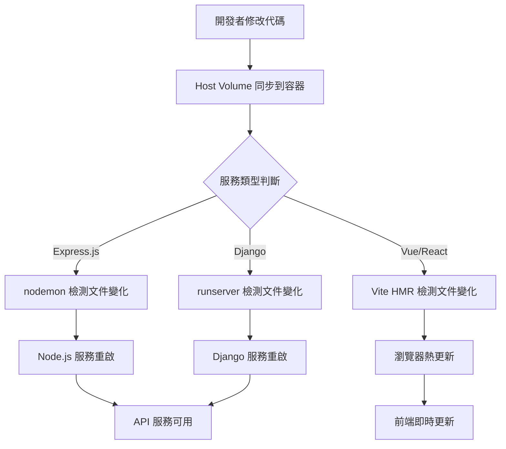

# AIOT 項目配置 - Claude Code

## 🏗️ 核心架構理念

**AIOT 項目採用雙環境分離架構**：

- **🐳 Docker Compose** = **開發環境專用**
  - 本地開發、Hot-reload、即時除錯
  - 快速啟動、資源靈活、開發者友好

- **☸️ Kubernetes** = **生產環境專用** 
  - 高可用部署、自動擴展、生產級穩定性
  - 完整監控、資源管控、安全隔離

**重要原則**：兩套環境各司其職，不混用！

---

## 📋 目錄
1. [核心架構理念](#核心架構理念)
2. [語言偏好設定](#語言偏好設定)
3. [代碼結構一致性原則](#代碼結構一致性原則)
4. [IDE 診斷和測試策略](#ide-診斷和測試策略)
5. [開發與生產環境架構](#開發與生產環境架構)
6. [Docker Compose 開發環境](#docker-compose-開發環境)
7. [Kubernetes 生產環境](#kubernetes-生產環境)
8. [API 開發規範](#api-開發規範)
9. [常用命令](#常用命令)

---

## 🌐 語言偏好設定
- **如果用戶使用繁體中文輸入，請用繁體中文回答**
- **If user inputs in English, respond in English**
- 根據用戶的輸入語言自動調整回應語言

---

## 🏗️ 代碼結構一致性原則
- **在新建或修改文件時，先查找相同前綴或後綴的現有文件**
- **分析現有文件的結構模式**：
  - 是否使用 class 還是 function
  - 常數定義方式（extract constants）
  - 靜態方法的使用
  - 導入/導出模式
  - 註釋和文檔風格
- **保持相同類型文件的結構一致性**
- **遵循現有的命名慣例和組織模式**

### 代碼風格規範
- **優先使用 class with arrow function 模式**：
  ```typescript
  @injectable()
  export class ExampleService {
    constructor(private dependency: SomeDependency) {}
    
    // 使用 arrow function 避免 this 綁定問題
    public processData = async (data: any): Promise<void> => {
      // 實作邏輯
    }
    
    private helperMethod = (param: string): string => {
      return param.toUpperCase();
    }
  }
  ```
- **路由類別使用 arrow function**：
  ```typescript
  @injectable()
  export class ExampleRoutes {
    private setupRoutes = (): void => {
      this.router.get('/endpoint', this.handleRequest);
    }
    
    private handleRequest = (req: Request, res: Response): void => {
      // 處理邏輯
    }
  }
  ```
- **控制器方法使用 arrow function**：
  ```typescript
  @injectable()
  export class ExampleController {
    public getData = async (req: Request, res: Response): Promise<void> => {
      // 控制器邏輯
    }
  }
  ```

### 路由結構規範
- **routes/index.ts 只負責註冊和組合路由，不包含具體實作**
- **各功能路由放在獨立的路由文件中**：
  ```
  /routes/
    ├── index.ts           # 路由註冊中心
    ├── healthRoutes.ts    # 健康檢查路由
    ├── userPreferenceRoutes.ts  # 用戶偏好設定路由
    └── docsRoutes.ts      # 動態文檔路由
  ```
- **路由文件命名規範**：`{功能名稱}Routes.ts`
- **每個路由文件都使用 class with arrow function 模式**

---

## 🔍 IDE 診斷和測試策略
- **使用 IDE 診斷功能檢查錯誤**：
  - 直接運行 `mcp__ide__getDiagnostics` 檢查語法和類型錯誤
  - 無需啟動完整服務來檢測基本問題
- **使用建置命令測試服務器問題**：
  - 後端：使用 `npm run build` 或 `npx tsc` 檢查 TypeScript 編譯錯誤
  - 前端：使用 `npm run build` 檢查 Vite 建置問題
  - **優先使用建置命令，避免每次都啟動完整服務器**
- **分層測試方法**：
  1. IDE 診斷 → 2. 建置測試 → 3. 只有在必要時才啟動服務器

---

## ⚙️ 開發與生產環境架構

### 🎯 環境分離策略
**AIOT 項目採用雙環境架構，開發和生產完全分離**

#### 🐳 開發環境 (Development) - Docker Compose
- **容器編排**：使用 Docker Compose 進行本地開發
- **Hot-Reload**：所有服務都支援即時重載
- **Volume 策略**：Host Volume 掛載實現即時同步
- **網路模式**：Bridge 網路，簡化服務間通訊
- **資源管理**：無資源限制，最大化開發效率
- **除錯支援**：開放除錯端口，支援 IDE 遠程除錯
- **資料庫**：使用 Docker 容器，支援快速重置

#### ☸️ 生產環境 (Production) - Kubernetes
- **容器編排**：使用 Kubernetes 進行生產部署
- **高可用性**：多副本部署，自動容錯與恢復
- **Volume 策略**：PV + PVC 持久化存儲
- **網路安全**：Service Mesh，ingress 控制
- **資源管理**：精確的 CPU/Memory 限制
- **監控告警**：完整的 metrics 和 logging
- **資料庫**：外部託管或集群化部署

---

## 🐳 Docker Compose 開發環境

### 🚀 後端開發 Hot-Reload

#### Express.js + nodemon 配置
```yaml
# docker-compose.yml - Express.js 微服務
version: '3.8'
services:
  rbac-service:
    build:
      context: ./microServices/rbac-service
      dockerfile: Dockerfile.dev
    container_name: aiot-rbac-service
    ports:
      - "3001:3001"
      - "9229:9229"  # Debug port
    volumes:
      - ./microServices/rbac-service/src:/app/src:rw
      - ./microServices/rbac-service/package.json:/app/package.json:ro
      - ./microServices/rbac-service/tsconfig.json:/app/tsconfig.json:ro
      - ./shared/types:/app/shared/types:ro
      - node_modules_rbac:/app/node_modules
    environment:
      - NODE_ENV=development
      - CHOKIDAR_USEPOLLING=true
      - CHOKIDAR_INTERVAL=1000
      - DEBUG=*
    command: nodemon --inspect=0.0.0.0:9229 --watch src --ext ts,js,json src/index.ts
    networks:
      - aiot-network
    depends_on:
      - database
      - redis
    restart: unless-stopped

volumes:
  node_modules_rbac:
    driver: local
```

```dockerfile
# Dockerfile.dev - Express.js 開發環境
FROM node:18-alpine

WORKDIR /app

# 安裝全域依賴
RUN npm install -g nodemon typescript ts-node

# 複製 package files
COPY package*.json ./
RUN npm ci

# 設置用戶權限
RUN addgroup -g 1001 -S nodejs
RUN adduser -S nodejs -u 1001
RUN chown -R nodejs:nodejs /app
USER nodejs

# 開放端口
EXPOSE 3001 9229

# 健康檢查
HEALTHCHECK --interval=30s --timeout=3s --start-period=5s --retries=3 \
  CMD curl -f http://localhost:3001/health || exit 1

# 預設命令 (會被 docker-compose 覆蓋)
CMD ["nodemon", "--inspect=0.0.0.0:9229", "src/index.ts"]
```

#### Django 內建 Hot-Reload 配置
```yaml
# docker-compose.yml - Django 微服務
version: '3.8'
services:
  llm-service:
    build:
      context: ./microServices/llm-service
      dockerfile: Dockerfile.dev
    container_name: aiot-llm-service
    ports:
      - "8020:8000"
      - "8021:8001"  # Django debug toolbar
    volumes:
      - ./microServices/llm-service:/app:rw
      - ./shared/types:/app/shared/types:ro
      - django_static:/app/staticfiles
      - django_media:/app/media
    environment:
      - DJANGO_SETTINGS_MODULE=config.settings.development
      - DJANGO_DEBUG=True
      - DJANGO_AUTORELOAD=True
      - PYTHONPATH=/app
      - PYTHONDONTWRITEBYTECODE=1
      - PYTHONUNBUFFERED=1
    command: python manage.py runserver 0.0.0.0:8000
    networks:
      - aiot-network
    depends_on:
      - database
      - redis
    restart: unless-stopped

volumes:
  django_static:
    driver: local
  django_media:
    driver: local
```

```dockerfile
# Dockerfile.dev - Django 開發環境
FROM python:3.11-alpine

WORKDIR /app

# 安裝系統依賴
RUN apk add --no-cache \
    postgresql-dev \
    gcc \
    musl-dev \
    linux-headers \
    curl

# 複製 requirements
COPY requirements/development.txt ./requirements.txt
RUN pip install --no-cache-dir -r requirements.txt

# 設置用戶權限
RUN addgroup -g 1001 -S django
RUN adduser -S django -u 1001
RUN chown -R django:django /app
USER django

# 開放端口
EXPOSE 8000

# 健康檢查
HEALTHCHECK --interval=30s --timeout=3s --start-period=10s --retries=3 \
  CMD curl -f http://localhost:8000/health/ || exit 1

# 預設命令 (會被 docker-compose 覆蓋)
CMD ["python", "manage.py", "runserver", "0.0.0.0:8000"]
```

#### Docker Compose 後端 Hot-Reload 特性
- **Express.js**: 使用 `nodemon` 監控文件變化，支援 `.js`、`.ts`、`.json` 文件
- **Django**: 內建 `runserver` 自動重載功能，檢測 `.py` 文件變化
- **Volume 掛載**: Host volume 直接掛載源代碼目錄，實現即時同步
- **除錯支援**: 開放 debug port，支援 IDE 遠程除錯
- **Named Volumes**: node_modules 使用命名卷，避免主機與容器權限衝突
- **環境變數**: `CHOKIDAR_USEPOLLING=true` 確保在容器環境中正常監控

### 🎨 前端開發 Hot-Reload

#### Vue 3 + Vite 配置
```yaml
# docker-compose.yml - Vue 3 前端
version: '3.8'
services:
  frontend-admin:
    build:
      context: ./frontend/admin-dashboard
      dockerfile: Dockerfile.dev
    container_name: aiot-frontend-admin
    ports:
      - "5173:5173"  # Vite dev server
      - "5174:5174"  # HMR WebSocket
    volumes:
      - ./frontend/admin-dashboard/src:/app/src:rw
      - ./frontend/admin-dashboard/public:/app/public:rw
      - ./frontend/admin-dashboard/package.json:/app/package.json:ro
      - ./frontend/admin-dashboard/vite.config.ts:/app/vite.config.ts:ro
      - ./frontend/admin-dashboard/index.html:/app/index.html:ro
      - ./shared/types:/app/shared/types:ro
      - vue_node_modules:/app/node_modules
    environment:
      - NODE_ENV=development
      - VITE_API_BASE_URL=http://localhost:8080
      - VITE_HMR_HOST=localhost
      - VITE_HMR_PORT=5174
      - CHOKIDAR_USEPOLLING=true
    command: npm run dev
    networks:
      - aiot-network
    restart: unless-stopped

volumes:
  vue_node_modules:
    driver: local
```

```dockerfile
# Dockerfile.dev - Vue 3 開發環境
FROM node:18-alpine

WORKDIR /app

# 安裝全域依賴
RUN npm install -g @vue/cli @vitejs/plugin-vue

# 複製 package files
COPY package*.json ./
RUN npm ci

# 設置用戶權限
RUN addgroup -g 1001 -S nodejs
RUN adduser -S nodejs -u 1001
RUN chown -R nodejs:nodejs /app
USER nodejs

# 開放端口
EXPOSE 5173 5174

# 健康檢查
HEALTHCHECK --interval=30s --timeout=3s --start-period=10s --retries=3 \
  CMD curl -f http://localhost:5173/ || exit 1

# 預設命令
CMD ["npm", "run", "dev"]
```

#### React + Vite 配置
```yaml
# docker-compose.yml - React 前端
version: '3.8'
services:
  frontend-user:
    build:
      context: ./frontend/user-portal
      dockerfile: Dockerfile.dev
    container_name: aiot-frontend-user
    ports:
      - "5175:5173"  # Vite dev server
      - "5176:5174"  # HMR WebSocket
    volumes:
      - ./frontend/user-portal/src:/app/src:rw
      - ./frontend/user-portal/public:/app/public:rw
      - ./frontend/user-portal/package.json:/app/package.json:ro
      - ./frontend/user-portal/vite.config.ts:/app/vite.config.ts:ro
      - ./frontend/user-portal/index.html:/app/index.html:ro
      - ./shared/types:/app/shared/types:ro
      - react_node_modules:/app/node_modules
    environment:
      - NODE_ENV=development
      - VITE_API_BASE_URL=http://localhost:8080
      - VITE_HMR_HOST=localhost
      - VITE_HMR_PORT=5176
      - FAST_REFRESH=true
      - CHOKIDAR_USEPOLLING=true
    command: npm run dev
    networks:
      - aiot-network
    restart: unless-stopped

volumes:
  react_node_modules:
    driver: local
```

```dockerfile
# Dockerfile.dev - React 開發環境
FROM node:18-alpine

WORKDIR /app

# 安裝全域依賴
RUN npm install -g @vitejs/plugin-react

# 複製 package files
COPY package*.json ./
RUN npm ci

# 設置用戶權限
RUN addgroup -g 1001 -S nodejs
RUN adduser -S nodejs -u 1001
RUN chown -R nodejs:nodejs /app
USER nodejs

# 開放端口
EXPOSE 5173 5174

# 健康檢查
HEALTHCHECK --interval=30s --timeout=3s --start-period=10s --retries=3 \
  CMD curl -f http://localhost:5173/ || exit 1

# 預設命令
CMD ["npm", "run", "dev"]
```

#### Vite 配置範例
```typescript
// vite.config.ts - Vue/React 通用配置
import { defineConfig } from 'vite'
import vue from '@vitejs/plugin-vue' // 或 react()

export default defineConfig({
  plugins: [vue()], // 或 react()
  server: {
    host: '0.0.0.0',
    port: 5173,
    hmr: {
      port: 5173,
      host: '0.0.0.0'
    },
    watch: {
      usePolling: true,
      interval: 1000
    }
  },
  resolve: {
    alias: {
      '@': '/app/src'
    }
  }
})
```

#### Docker Compose 前端 Hot-Reload 特性
- **Vite HMR**: 極速的熱模組替換，支援 Vue/React 組件即時更新
- **Fast Refresh**: React 專用的狀態保持熱重載
- **CSS Hot Update**: 樣式文件變化無需整頁刷新
- **TypeScript 支援**: 即時類型檢查和錯誤提示
- **Asset Hot Reload**: 靜態資源變化自動更新
- **Multi-Port**: 每個前端應用使用不同端口，避免衝突

### 🗂️ 完整 Docker Compose 開發環境
```yaml
# docker-compose.yml - 完整開發環境
version: '3.8'

services:
  # 資料庫服務
  database:
    image: postgres:15-alpine
    container_name: aiot-database
    ports:
      - "5432:5432"
    environment:
      - POSTGRES_DB=aiot_development
      - POSTGRES_USER=aiot
      - POSTGRES_PASSWORD=development_password
    volumes:
      - postgres_data:/var/lib/postgresql/data
      - ./database/init:/docker-entrypoint-initdb.d
    networks:
      - aiot-network

  # Redis 緩存
  redis:
    image: redis:7-alpine
    container_name: aiot-redis
    ports:
      - "6379:6379"
    volumes:
      - redis_data:/data
    networks:
      - aiot-network

  # API Gateway (Kong)
  kong:
    image: kong:3.4
    container_name: aiot-kong
    ports:
      - "8080:8000"  # Proxy
      - "8081:8001"  # Admin API
    environment:
      - KONG_DATABASE=off
      - KONG_DECLARATIVE_CONFIG=/kong/kong.dev.yml
      - KONG_PROXY_ACCESS_LOG=/dev/stdout
      - KONG_ADMIN_ACCESS_LOG=/dev/stdout
      - KONG_PROXY_ERROR_LOG=/dev/stderr
      - KONG_ADMIN_ERROR_LOG=/dev/stderr
      - KONG_ADMIN_LISTEN=0.0.0.0:8001
    volumes:
      - ./infrastructure/kong/kong.dev.yml:/kong/kong.dev.yml:ro
    networks:
      - aiot-network
    depends_on:
      - rbac-service
      - drone-service
      - llm-service

volumes:
  postgres_data:
  redis_data:
  node_modules_rbac:
  django_static:
  django_media:
  vue_node_modules:
  react_node_modules:

networks:
  aiot-network:
    driver: bridge
```

### 🔄 Docker Compose Hot-Reload 工作流程


---

## ☸️ Kubernetes 生產環境

### 🎯 生產環境專用部署
**Kubernetes 專注於生產環境，提供企業級的可靠性、擴展性和運維能力**

#### 🚀 生產環境特性
- **命名空間**：`aiot-prod` (生產專用)
- **高可用部署**：多副本、滾動更新、自動容錯恢復
- **資源管理**：精確的 CPU/Memory 限制和請求
- **網路安全**：Service Mesh、NetworkPolicy、Ingress 控制
- **監控告警**：Prometheus + Grafana + AlertManager
- **日誌管理**：ELK Stack 或 Loki 集中化日誌收集
- **自動擴展**：HPA (Horizontal Pod Autoscaler)
- **容器架構**：InitContainer + Main Container + Sidecar 模式

### 📁 生產環境 Volume 策略
```
volume-strategy/
├── persistentVolumes/             # 持久化存儲
│   ├── database-pv.yaml          # 數據庫 PV
│   ├── logs-pv.yaml               # 日誌 PV
│   └── uploads-pv.yaml            # 上傳文件 PV
├── persistentVolumeClaims/        # 存儲聲明
│   ├── database-pvc.yaml         # 數據庫 PVC
│   ├── logs-pvc.yaml              # 日誌 PVC
│   └── uploads-pvc.yaml           # 上傳文件 PVC
└── configMaps/                    # 配置文件
    ├── prod-environment.yaml     # 生產環境變數
    └── service-configs/           # 服務配置目錄
```

### 🐳 容器架構模式

#### InitContainer + Main Container 架構
```yaml
# 微服務完整架構模式
spec:
  # 初始化容器 - 負責環境準備
  initContainers:
  - name: init-setup
    image: node:18-alpine
    command: ['sh', '-c']
    args:
      - |
        echo "Initializing application..."
        npm ci --only=production
        npm run build:prepare
        chown -R node:node /app
    volumeMounts:
    - name: app-workspace
      mountPath: /app
    - name: source-code
      mountPath: /app/src
    - name: config-files
      mountPath: /app/config
    
  # 主容器 - 運行應用服務
  containers:
  - name: main-service
    image: node:18-alpine
    command: ['npm', 'run', 'start']
    volumeMounts:
    - name: app-workspace
      mountPath: /app
    - name: source-code
      mountPath: /app/src
      readOnly: true  # 開發環境可設為 false
    - name: config-files
      mountPath: /app/config
      readOnly: true
    - name: logs-storage
      mountPath: /app/logs
    envFrom:
    - configMapRef:
        name: environment-config
    - secretRef:
        name: app-secrets
        
  # Volume 定義
  volumes:
  # 開發環境使用 hostPath
  - name: source-code
    hostPath:
      path: /host/project/src
      type: Directory
  # 配置文件使用 ConfigMap
  - name: config-files
    configMap:
      name: service-config
  # 工作空間使用 emptyDir
  - name: app-workspace
    emptyDir:
      sizeLimit: 1Gi
  # 日誌存儲（生產環境使用 PVC）
  - name: logs-storage
    persistentVolumeClaim:
      claimName: logs-pvc
```

### 💾 數據庫持久化配置

#### PersistentVolume (PV) 配置
```yaml
# database-pv.yaml
apiVersion: v1
kind: PersistentVolume
metadata:
  name: database-pv
  labels:
    type: database
    environment: production
spec:
  capacity:
    storage: 20Gi
  accessModes:
    - ReadWriteOnce
  persistentVolumeReclaimPolicy: Retain
  storageClassName: fast-ssd
  hostPath:
    path: /data/postgresql
    type: DirectoryOrCreate
```

#### PersistentVolumeClaim (PVC) 配置
```yaml
# database-pvc.yaml
apiVersion: v1
kind: PersistentVolumeClaim
metadata:
  name: database-pvc
  namespace: aiot
spec:
  accessModes:
    - ReadWriteOnce
  resources:
    requests:
      storage: 20Gi
  storageClassName: fast-ssd
  selector:
    matchLabels:
      type: database
      environment: production
```

#### 數據庫服務 Volume 掛載
```yaml
# 數據庫服務完整配置
spec:
  containers:
  - name: postgresql
    image: postgres:15-alpine
    volumeMounts:
    - name: database-storage
      mountPath: /var/lib/postgresql/data
    - name: database-config
      mountPath: /etc/postgresql/postgresql.conf
      subPath: postgresql.conf
    - name: init-scripts
      mountPath: /docker-entrypoint-initdb.d
    envFrom:
    - secretRef:
        name: database-secrets
  volumes:
  - name: database-storage
    persistentVolumeClaim:
      claimName: database-pvc
  - name: database-config
    configMap:
      name: database-config
  - name: init-scripts
    configMap:
      name: database-init-scripts
```

### 🔄 Hot-reload 實現原理
1. **HostPath** 掛載本地開發代碼，實現即時同步
2. **ConfigMap** 包含配置文件和環境變數
3. **emptyDir** 作為構建工作目錄，支援文件修改
4. **InitContainer** 負責依賴安裝和環境準備
5. **Main Container** 運行 nodemon/Django runserver 監控文件變化
6. **環境變數** `CHOKIDAR_USEPOLLING=true` 確保文件監控正常

### 🚀 部署命令

#### 🐳 Docker Compose 開發環境部署
```bash
# 啟動完整開發環境
docker-compose up -d

# 啟動特定服務
docker-compose up -d database redis

# 重建並啟動服務 (代碼變更後)
docker-compose up -d --build rbac-service

# 查看服務日誌
docker-compose logs -f rbac-service

# 停止所有服務
docker-compose down

# 停止並清除所有數據
docker-compose down -v
```

#### ☸️ Kubernetes 生產環境部署
```bash
# 部署生產環境 ConfigMaps
kubectl apply -f infrastructure/kubernetes/configmaps/ -n aiot-prod

# 部署生產環境微服務
kubectl apply -f infrastructure/kubernetes/production/ -n aiot-prod

# 檢查部署狀態
kubectl get pods -n aiot-prod

# 滾動更新
kubectl rollout restart deployment/rbac-service -n aiot-prod
```

### 🌐 重要端點

#### 🐳 Docker Compose 開發環境
- **API Gateway (Kong)**：http://localhost:8080
- **Kong Admin API**：http://localhost:8081
- **Database (PostgreSQL)**：localhost:5432
- **Redis**：localhost:6379
- **RBAC Service**：http://localhost:3001
- **LLM Service**：http://localhost:8020
- **Vue Admin Dashboard**：http://localhost:5173
- **React User Portal**：http://localhost:5175

#### ☸️ Kubernetes 生產環境
- **API Gateway (Kong)**：透過 Ingress 控制器
- **Kong Admin API**：內部網路存取
- **Monitoring (Grafana)**：透過 Ingress 控制器
- **Consul UI**：`kubectl port-forward -n aiot-prod svc/consul-service 8500:8500`

### 🚨 故障排除

#### 🐳 Docker Compose 故障排除
```bash
# 查看容器狀態
docker-compose ps

# 查看服務日誌
docker-compose logs <service-name>

# 進入容器除錯
docker-compose exec <service-name> /bin/sh

# 重建有問題的服務
docker-compose up -d --build <service-name>

# 檢查網路連接
docker network ls
docker network inspect aiot_aiot-network
```

#### ☸️ Kubernetes 故障排除
```bash
# 查看 Pod 詳情
kubectl describe pod <pod-name> -n aiot-prod

# 查看容器日誌
kubectl logs <pod-name> -n aiot-prod

# 進入容器調試
kubectl exec -it <pod-name> -n aiot-prod -- /bin/bash

# ConfigMap 檢查
kubectl get configmap -n aiot-prod

# Volume 檢查
kubectl describe pod <pod-name> -n aiot-prod | grep -A 10 Volumes

# 檢查 PV/PVC 狀態
kubectl get pv,pvc -n aiot-prod
```

---

## 📡 API 開發規範

### 控制器回應格式
- 所有 API 端點必須使用 `ControllerResult` 類別
- 統一回應格式：`{ status: number, message: string, data?: any }`
- 避免直接使用 `res.json()` 或 `res.status().json()`

### 認證系統
- 使用 JWT + httpOnly cookie 認證機制
- `/api/auth/me` 端點用於檢查認證狀態
- 預設管理員帳號：`admin` / `admin`
- **重要**：前端初始化時的 401 錯誤是正常的（表示尚未登入）
- axios 攔截器已優化，不會在認證檢查時自動重定向

---

## 🛠️ 常用命令

### 測試 API 端點
```bash
# 登入（通過 Kong Gateway）
curl -X POST http://localhost:30000/api/auth/login -H "Content-Type: application/json" -d '{"username":"admin","password":"admin"}' -c /tmp/cookies.txt

# 測試認證端點
curl -s http://localhost:30000/api/auth/me -b /tmp/cookies.txt

# 測試其他 API（需要認證）
curl -s http://localhost:30000/api/rbac/roles -b /tmp/cookies.txt
```

### 服務狀態檢查
```bash
# 檢查所有 Pod 狀態
kubectl get pods -n aiot

# 檢查所有服務狀態
kubectl get services -n aiot

# 檢查特定服務日誌
kubectl logs -n aiot <pod-name> --tail=20

# 檢查微服務日誌範例
kubectl logs -n aiot -l app=rbac-service --tail=20
kubectl logs -n aiot -l app=drone-service --tail=20
```

### 🔧 Volume 掛載最佳實踐
```bash
# 檢查 PV 狀態
kubectl get pv

# 檢查 PVC 狀態
kubectl get pvc -n aiot

# 檢查 Volume 掛載詳情
kubectl describe pod <pod-name> -n aiot | grep -A 20 Volumes

# 檢查 HostPath 掛載
kubectl exec -it <pod-name> -n aiot -- ls -la /app/src

# 檢查 InitContainer 日誌
kubectl logs <pod-name> -n aiot -c init-setup
```

### 📊 資源監控命令
```bash
# 檢查存儲使用情況
kubectl top pods -n aiot

# 檢查節點存儲情況
kubectl describe nodes | grep -A 5 "Allocated resources"

# 檢查 PVC 使用情況
kubectl get pvc -n aiot -o custom-columns=NAME:.metadata.name,STATUS:.status.phase,VOLUME:.spec.volumeName,CAPACITY:.status.capacity.storage
```

---

## 📝 重要提醒

### ✅ 已實現的 K8s 最佳實踐
- ✅ **ConfigMap + emptyDir** 基礎架構已部署
- ✅ **HostPath + ConfigMap** 組合用於開發環境
- ✅ **InitContainer + Main Container** 架構模式
- ✅ **PV + PVC** 數據庫持久化存儲配置
- ✅ **多環境配置** 開發/生產環境分離
- ✅ **Volume 分層策略** 不同數據類型使用適當的存儲方案