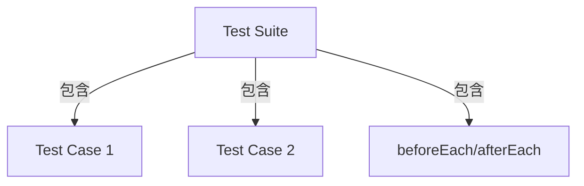
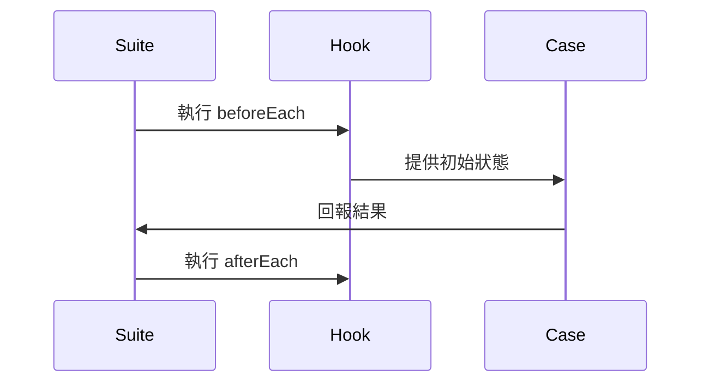

# Jest describe 語法完整指南

`describe` 是 Jest 測試框架的核心語法，用於組織測試案例。

## 1. 基本結構
```typescript
describe('測試單元描述', () => {
  it('測試案例描述', () => {
    // 測試邏輯
  });
});
```

## 2. 核心功能
| 語法            | 用途                          | 執行時機           |
|-----------------|-------------------------------|--------------------|
| `describe()`    | 定義測試套件 (Test Suite)      | 檔案載入時解析     |
| `it()`/`test()` | 定義單個測試案例 (Test Case)   | 執行測試時運行     |
| `beforeEach()`  | 每個測試前的初始化邏輯         | 每個 it() 執行前   |
| `afterEach()`   | 每個測試後的清理邏輯           | 每個 it() 執行後   |

## 3. Test Suite 與 Test Case 關聯

### 從屬關係


### 具體對照
| 概念          | Test Suite (`describe`)           | Test Case (`it`)              |
|---------------|-----------------------------------|-------------------------------|
| **角色**      | 測試容器 (分類用)                 | 最小測試單位 (實際驗證)       |
| **執行範圍**  | 整個區塊內的 hooks 和 test cases  | 單一測試情境                  |

### 範例程式
```typescript
describe('UserService', () => {  // Test Suite
  beforeEach(() => { /* 共享準備 */ });
  
  it('應驗證郵箱格式', () => {   // Test Case
    expect(validateEmail('test@')).toBe(false);
  });
});
```

### 執行流程


## 4. 實際範例
```typescript
describe('PermissionController', () => {
  beforeEach(() => {
    // 初始化代碼
  });

  describe('GET /permissions', () => {
    it('應返回 200 狀態碼', () => {
      // 測試邏輯
    });
  });
});
```

## 5. 進階用法
- **巢狀結構**：可無限層級嵌套
- **專注測試**：使用 `describe.only()`
- **跳過測試**：使用 `describe.skip()`

## 6. 與其他框架對比
| 框架    | 類似語法     | 特點               |
|---------|-------------|--------------------|
| Mocha   | `describe`  | 需額外安裝断言庫   |
| Jasmine | `describe`  | 內建完整工具鏈      |
| Vitest  | `describe`  | 針對 Vite 優化      |